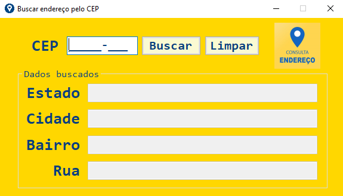
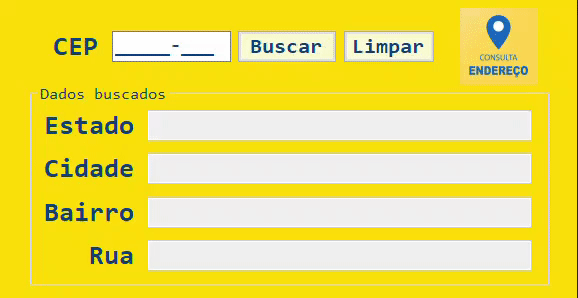

<h1 align="center">📬 Buscar endereço pelo CEP</h1>

    
    

 

    

<h2>&#X1F4DD Descrição do projeto</h2>

Neste projeto foi usado a API <a href="https://viacep.com.br/">Via CEP</a> para que quando o usuário digitasse o CEP, fosse buscado os dados daquela localidade e fizesse um auto-complete nos campos.

O projeto tem duas versões.

<h2>1️⃣ Primeira versão</h2>

Na primeira versão foi usado o pacote <a href="https://github.com/MosaicoSolutions/ViaCep">MosaicoSolutions.ViaCep<a> para facilitar o request de dados da API e o pacote <a href="https://www.newtonsoft.com/json">Newtonsoft.Json</a> para fazer a deserialização do json que é retornado pela API.

<h2>2️⃣ Segunda versão</h2>

Na segunda versão foi feito um request diretamente da API usando a classe <a href="https://learn.microsoft.com/en-us/dotnet/api/system.net.http.httpclient?view=net-7.0">HttpClient</a> e o pacote <a href="https://www.newtonsoft.com/json">Newtonsoft.Json</a> para fazer a deserialização do json que é retornado pela API que foi convertido para um objeto do tipo <a href="https://github.com/DKAT-DAVI/find-adress-by-CEP/blob/main/Release2/find-adress-by-CEP/Adress.cs">Adress</a>.

<h2>&#X1F528 Funcionalidades do projeto</h2>

<ul>
    <li>Tela principal com uma textbox para inserir o CEP, botão para acionar a busca e um botão para limpar os resultados obtidos.</li>
    <li>Ao inserir o CEP e clicar em BUSCAR, o programa vai preencher od campos com os dados buscados.</li>

</ul>

    

<h2>&#X1F4C1 Acesso ao projeto</h2>

As duas versões estão disponíveis neste repositório, faça download viz arquivo zip ou clone este repositório na sua máquina Windows e compile o código utilizando o <a href="https://visualstudio.microsoft.com/downloads/">Visual Studio</a>.

<ul>
    <li>Download <a>PrimeiraVersão.zip</a></li>
    <li>Download <a>SegundaVersão.zip</a></li>
</ul>

<h2>&#X2714 Técnicas e Tecnologias utilizadas</h2>
<ul>
    <li>
        Linguagem C#
    </li>
    <li>    
        
        Visual Studio  
    </li>
    <li><bigger><b>POO</b></bigger> programação orientada a obejtos</li>
</ul>
<ul><b>Dependêcias</b>
    <li>API <a href="https://viacep.com.br/">Via CEP</a></li>
    <li>Pacote <a href="https://github.com/MosaicoSolutions/ViaCep">MosaicoSolutions.ViaCep<a></li>
    <li>Pacote <a href="https://www.newtonsoft.com/json">Newtonsoft.Json</a></li>
</ul>

          
[)](https://www.linkedin.com/in/dkat-davi/)

